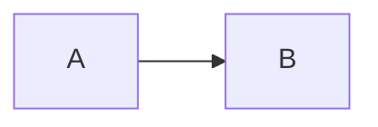
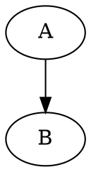

# Claude Instructions for Diagramming Skill Development

## Repository Purpose

This is a **security-hardened diagramming skill** for Claude Code featuring:
- 20+ diagram types (Mermaid + DOT/Graphviz)
- Security-hardened rendering tools (0 npm vulnerabilities)
- 12,000+ lines of comprehensive documentation
- Self-contained skill structure with bundled tools
- WCAG AA accessible color palette (Cagle system)

**Fork origin:** Based on sparkling/claude-config with security fixes and restructuring.

---

## Security-First Development ⚠️

### CRITICAL: Security Requirements

All rendering tools in `skills/diagramming/mermaid/` and `dot/` are **security-hardened**. When modifying these tools, you MUST maintain security standards:

#### ✅ Required Practices

1. **Command Execution**
   - ALWAYS use `execFileSync()` or `execFile()` with argument arrays
   - NEVER use `execSync()` or `exec()` with string interpolation
   - Example:
     ```javascript
     // ✅ CORRECT - No shell injection possible
     execFileSync('pandoc', [inputPath, '-o', outputPath])

     // ❌ WRONG - Command injection vulnerability
     execSync(`pandoc "${inputPath}" -o "${outputPath}"`)
     ```

2. **Path Validation**
   - ALWAYS use `validateOutputPath()` from `lib/security.js`
   - Validate ALL user-provided paths (input, output, directories)
   - Example:
     ```javascript
     const { validateOutputPath } = require('../lib/security');
     const validPath = validateOutputPath(userPath, process.cwd());
     ```

3. **Resource Limits**
   - ALWAYS use `launchSecureBrowser()` from `lib/puppeteer-helper.js`
   - NEVER launch Puppeteer without timeouts
   - Default timeouts: 30s browser, 15s page operations

4. **Dependency Management**
   - NO external CDN dependencies at runtime
   - Bundle ALL JavaScript libraries locally (npm packages)
   - Example: Mermaid is bundled, NOT loaded from CDN

#### ❌ Prohibited Practices

- Shell interpolation with user input
- Path operations without validation
- Puppeteer without timeouts
- Loading code from external URLs at runtime
- Skipping security helpers "for convenience"

### Testing Security After Changes

After ANY modifications to rendering tools:

```bash
# 1. Run npm audit (MUST show 0 vulnerabilities)
cd skills/diagramming/mermaid && npm audit
cd ../dot && npm audit

# 2. Test with malicious inputs (see SECURITY.md)
# Path traversal
node mermaid/render-mermaid.js test.mmd ../../etc/passwd.svg

# Command injection
node mermaid/md-to-pdf.js "test; rm -rf /" output.pdf

# 3. Verify timeouts work (should timeout gracefully)
timeout 45s node mermaid/render-mermaid.js complex-diagram.mmd out.svg
```

All malicious inputs should be **rejected** or **sanitized**, not executed.

---

## Skill Documentation Standards

### Documentation Structure

```
skills/diagramming/
├── SKILL.md                          # Main entry point (<500 lines)
├── README.md                         # Installation, features, quick start
├── 02-08-*-GUIDE.md                 # Core diagram types
├── 09-STYLING-GUIDE.md              # Colors, themes, accessibility
├── 10-USE-CASE-SCENARIOS.md         # Diagram selection guide
├── 12-15-*-GUIDE.md                 # Architecture patterns
├── 16-CONFIGURATION-REFERENCE.md    # All config options
├── 17-19-*-GUIDE.md                 # Specialized diagrams
└── 20-21-*-EXPORT.md                # Export workflows
```

### File Naming Convention

| Prefix | Type | Examples |
|--------|------|----------|
| `02-08` | Core diagram types | 02-FLOWCHART, 03-SEQUENCE, 06-ER |
| `09` | Styling & colors | 09-STYLING-GUIDE |
| `10` | Selection guide | 10-USE-CASE-SCENARIOS |
| `12-15` | Architecture | 12-SOLUTION-ARCHITECTURE, 14-DEPLOYMENT |
| `16` | Configuration | 16-CONFIGURATION-REFERENCE |
| `17-19` | Specialized | 17-LINKED-DATA, 19-DOT-GRAPHVIZ |
| `20-21` | Export tools | 20-MERMAID-EXPORT, 21-DOT-EXPORT |

### Updating Documentation

#### SKILL.md Requirements
- **Keep under 500 lines** - Progressive disclosure principle
- Update routing table when adding diagram types
- Include export section with relative paths
- Maintain Cagle color palette reference

#### Guide File Standards
- Start with quick reference (1-3 lines)
- Include "When to Use" section
- Provide complete syntax examples
- Add troubleshooting section
- Cross-reference related guides

#### Code Examples
- ALL code examples MUST be tested
- Include complete examples (not fragments)
- Show both simple and complex cases
- Document all options and flags

### Cagle Color Palette Consistency

When documenting colors, ALWAYS use this semantic palette:

| Type | Fill | Stroke | Use Case |
|------|------|--------|----------|
| Infrastructure | `#E3F2FD` | `#1565C0` | Cloud, platforms |
| Service | `#E8F5E9` | `#2E7D32` | APIs, microservices |
| Data | `#FFF8E1` | `#F57F17` | Databases, storage |
| User/Actor | `#F3E5F5` | `#7B1FA2` | People, roles |
| Process | `#E1F5FE` | `#0277BD` | Workflows, actions |
| Security | `#E0F2F1` | `#00695C` | Auth, encryption |

All colors meet **WCAG AA** contrast requirements.

---

## Code Quality Standards

### JavaScript Tools

#### File Structure
```javascript
#!/usr/bin/env node
const fs = require('fs').promises;  // Use promises API
const path = require('path');
const { validateOutputPath } = require('../lib/security');
const { launchSecureBrowser, createSecurePage } = require('../lib/puppeteer-helper');

async function main() {
  try {
    // Validate inputs
    const validPath = validateOutputPath(inputPath, process.cwd());

    // Business logic
    const result = await doWork(validPath);

    // Output
    console.log(result);
  } catch (error) {
    console.error('Error:', error.message);
    process.exit(1);
  }
}

if (require.main === module) {
  main();
}

module.exports = { main };
```

#### Error Handling
- ALWAYS wrap async operations in try/catch
- Provide helpful error messages
- Exit with code 1 on errors
- Clean up resources (close browsers, delete temp files)

#### Path Handling
- Use `path.join()` for cross-platform compatibility
- ALWAYS validate with `validateOutputPath()`
- Use absolute paths internally
- Sanitize filenames with `path.basename()`

---

## Git Operations Safety

### Prohibited Commands (Without User Approval)

**NEVER use these git commands without EXPLICIT user approval:**
- `git checkout` (files or branches)
- `git revert`
- `git reset`
- `git restore`
- `git stash`

### Why This Rule Exists

These commands can **destroy uncommitted work** in:
- Rendering tools (hours of security hardening)
- Documentation files (thousands of lines of content)
- Configuration files

### What to Do Instead

1. **To fix an error:** Use Edit tool to correct the file directly
2. **To undo changes:** Explain the situation and ASK user for approval
3. **To restore a file:** Tell user what will be lost, wait for approval

**Violation of this rule is unacceptable** - it has caused catastrophic data loss in the past.

---

## Testing Before Commits

### Pre-Commit Checklist

Before committing changes, verify:

- [ ] **Skill loads correctly**
  - SKILL.md routing table works
  - No syntax errors in JavaScript files

- [ ] **Rendering works**
  - Test simple diagram: `echo "flowchart TD; A-->B" | node mermaid/render-mermaid.js --stdin test.svg`
  - Test DOT diagram: `echo "digraph { A -> B }" | node dot/render-dot.js --stdin test.svg`

- [ ] **Security audit passes**
  - `cd skills/diagramming/mermaid && npm audit` → 0 vulnerabilities
  - `cd skills/diagramming/dot && npm audit` → 0 vulnerabilities

- [ ] **Documentation is valid**
  - No broken internal links
  - All cross-references exist
  - Code examples are tested

- [ ] **Export tools work**
  - `node mermaid/process-document.js test.md --dry-run`
  - `node dot/process-document.js test.md --dry-run`

### Integration Testing

```bash
# Create test document
cat > test.md <<'EOF'
# Test Document




EOF

# Test Mermaid export
node skills/diagramming/mermaid/process-document.js test.md --verbose

# Test DOT export
node skills/diagramming/dot/process-document.js test.md --verbose

# Verify images created
ls -la diagrams/test/
```

---

## Adding New Features

### When Adding a New Diagram Type

1. **Create guide file** (e.g., `22-NEW-DIAGRAM-GUIDE.md`)
   - Follow existing guide structure
   - Include quick reference, syntax, examples
   - Add troubleshooting section

2. **Update SKILL.md routing table**
   - Add entry to "Diagram Type Router" table
   - Add to "Decision Logic" priority list
   - Update "Essential Configuration" if needed

3. **Update README.md**
   - Add to features list
   - Add to diagram types table
   - Update directory structure if needed

4. **Update skill README**
   - Add to `skills/diagramming/README.md`
   - Update "What's Included" section

5. **Test routing**
   - Ask Claude to create the new diagram type
   - Verify correct guide loads
   - Ensure examples work

### When Adding/Modifying Tools

1. **Security review**
   - Apply all security practices above
   - Add path validation
   - Add timeouts to async operations
   - Use secure helpers

2. **Update export guides**
   - Document in 20-MERMAID-EXPORT.md or 21-DOT-EXPORT.md
   - Add usage examples
   - Add troubleshooting

3. **Update package.json**
   - Add dependencies if needed
   - Update version number
   - Run `npm install` and test

4. **Security audit**
   - Run `npm audit`
   - Fix any vulnerabilities
   - Document in SECURITY.md if significant

### When Updating Marketplace

After significant changes:

1. **Bump version** in:
   - `.claude-plugin/plugin.json`
   - `.claude-plugin/marketplace.json`
   - All relevant `package.json` files

2. **Update INSTALL.md** if installation process changes

3. **Update README.md** with new features

4. **Tag release** (optional):
   ```bash
   git tag -a v1.1.0 -m "Version 1.1.0 - Added feature X"
   git push origin v1.1.0
   ```

---

## Commit Message Standards

Use clear, descriptive commit messages:

```bash
# Good commit messages
git commit -m "Add support for XY chart diagrams with examples"
git commit -m "Fix path traversal in svg-to-png.js conversion"
git commit -m "Update SKILL.md routing for new quadrant chart type"

# Bad commit messages
git commit -m "fix bug"
git commit -m "update docs"
git commit -m "changes"
```

Format for security fixes:
```
Fix CRITICAL command injection in [file]

SECURITY: [Brief description]

- Details of fix
- Testing performed
- Related CVE/advisory if applicable
```

---

## Questions or Issues?

- Security concerns → See [SECURITY.md](SECURITY.md)
- Installation issues → See [INSTALL.md](INSTALL.md)
- Usage questions → See [skills/diagramming/README.md](skills/diagramming/README.md)
- Kurt Cagle's approach → See guides 09, 17-19

**Remember:** This skill helps users create accessible, professional diagrams. Quality and security matter!
