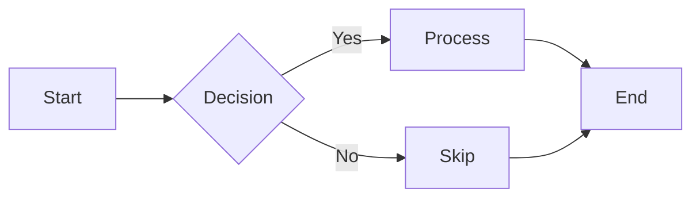
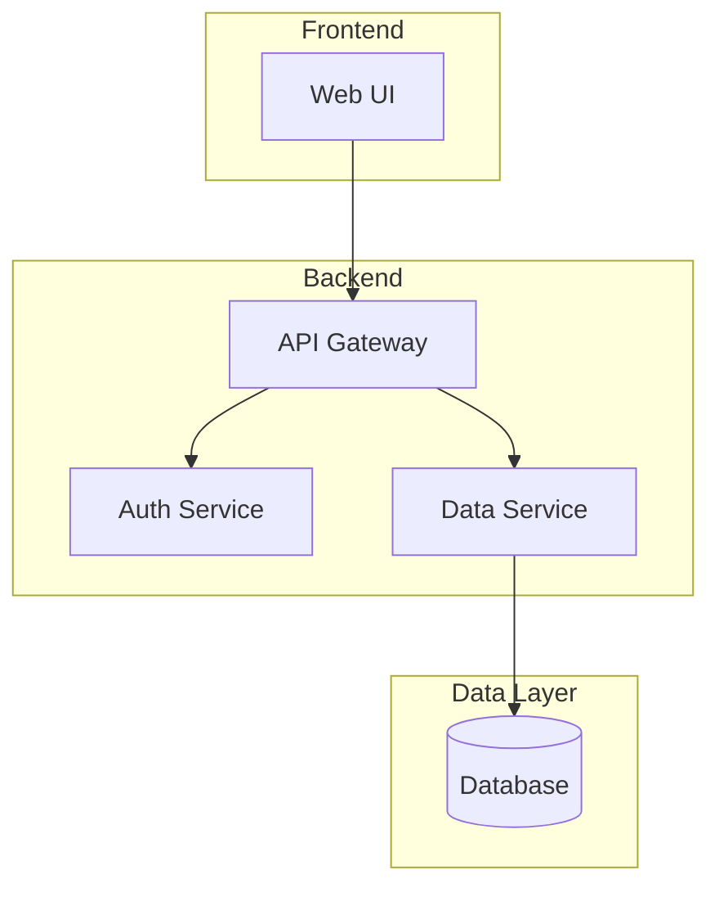

# Diagramming Skills for Claude Code

Professional diagram generation with **security-hardened** rendering tools.

[](SECURITY.md)
[](SECURITY.md)
[](LICENSE)

## Features

✨ **Comprehensive Diagram Support**
- 🔄 Flowcharts, Sequence Diagrams, State Machines
- 📊 Class Diagrams, ER Diagrams, Gantt Charts
- 🏗️ Architecture Diagrams (System, Cloud, K8s, CI/CD)
- 🌐 DOT/Graphviz for Network Graphs & Semantic Webs
- 🎨 Semantic Color Palette (Cagle) - WCAG AA Compliant

🛡️ **Security Hardened**
- ✅ Fixed CRITICAL command injection vulnerability (RCE)
- ✅ Path traversal protection across all tools
- ✅ Resource exhaustion prevention (DoS protection)
- ✅ CDN dependencies eliminated (supply chain security)
- ✅ 0 npm vulnerabilities (audited)

📦 **Export & Rendering**
- PNG/SVG export with Puppeteer
- Document processing (process entire .md files)
- Re-rendering support (update diagrams in-place)
- ELK layout for complex graphs

## Quick Install (Marketplace)

### Option 1: Install from GitHub Marketplace

```bash
# Add marketplace
/plugin marketplace add th3b0y/agent-marketplace

# Install the diagramming skill
/plugin install diagramming@agent-marketplace
```

### Option 2: Manual Installation

```bash
# Clone the repository
git clone https://github.com/th3b0y/agent-marketplace.git

# Copy skill to Claude Code
cp -r agent-marketplace/skills/diagramming ~/.claude/skills/

# Install dependencies
cd ~/.claude/skills/diagramming/mermaid && npm install
cd ~/.claude/skills/diagramming/dot && npm install
```

## Usage

### Creating Diagrams

Just ask Claude to create any diagram:

```
"Create a flowchart showing the user authentication process"
"Draw a sequence diagram for the checkout API"
"Generate a system architecture diagram for microservices"
```

Claude automatically invokes the diagramming skill and generates the appropriate diagram type.

### Exporting to Images

After creating diagrams in your document:

```bash
# Export Mermaid diagrams to PNG
node ~/.claude/skills/diagramming/mermaid/process-document.js README.md --verbose

# Export DOT diagrams to SVG
node ~/.claude/skills/diagramming/dot/process-document.js README.md --verbose
```

See [skills/diagramming/20-MERMAID-EXPORT.md](skills/diagramming/20-MERMAID-EXPORT.md) and [21-DOT-EXPORT.md](skills/diagramming/21-DOT-EXPORT.md) for complete workflows.

## What's Included

### Diagram Types

| Type | Use Case | Guide |
|------|----------|-------|
| **Flowcharts** | Process flows, decision trees | [02-FLOWCHART](skills/diagramming/02-FLOWCHART-GUIDE.md) |
| **Sequence** | API interactions, service calls | [03-SEQUENCE](skills/diagramming/03-SEQUENCE-DIAGRAM-GUIDE.md) |
| **Class** | OOP design, code architecture | [04-CLASS](skills/diagramming/04-CLASS-DIAGRAM-GUIDE.md) |
| **State** | State machines, workflows | [05-STATE](skills/diagramming/05-STATE-DIAGRAM-GUIDE.md) |
| **ER** | Database schemas, data models | [06-ER](skills/diagramming/06-ER-DIAGRAM-GUIDE.md) |
| **Gantt** | Project timelines, schedules | [07-GANTT](skills/diagramming/07-GANTT-GUIDE.md) |
| **Architecture** | System design, cloud, K8s | [12-SOLUTION](skills/diagramming/12-SOLUTION-ARCHITECTURE-GUIDE.md) |
| **DOT/Graphviz** | Network graphs, ontologies | [19-DOT](skills/diagramming/19-DOT-GRAPHVIZ-GUIDE.md) |

Plus: Pie charts, mindmaps, journey maps, timelines, C4, sankey, and more in [08-OTHER-DIAGRAMS](skills/diagramming/08-OTHER-DIAGRAMS-GUIDE.md).

### Documentation

- **[SKILL.md](skills/diagramming/SKILL.md)** - Main skill entry point with routing
- **[README.md](skills/diagramming/README.md)** - Comprehensive skill documentation
- **21 specialized guides** - 12,000+ lines of documentation
- **[SECURITY.md](SECURITY.md)** - Security improvements and audit results

### Rendering Tools (Self-Contained)

```
skills/diagramming/
├── mermaid/              # Mermaid renderer (security-hardened)
│   ├── render-mermaid.js
│   ├── process-document.js
│   ├── svg-to-png.js
│   └── md-to-pdf.js
├── dot/                  # DOT/Graphviz renderer
│   ├── render-dot.js
│   └── process-document.js
└── lib/                  # Shared security utilities
    ├── security.js       # Path validation
    └── puppeteer-helper.js  # Secure browser launch
```

## The Cagle Color System

Semantic colors for professional, accessible diagrams:

| Type | Fill | Stroke | Use Case |
|------|------|--------|----------|
| Infrastructure | `#E3F2FD` | `#1565C0` | Cloud, platforms, networks |
| Service | `#E8F5E9` | `#2E7D32` | APIs, microservices |
| Data | `#FFF8E1` | `#F57F17` | Databases, storage |
| User/Actor | `#F3E5F5` | `#7B1FA2` | People, roles |
| Process | `#E1F5FE` | `#0277BD` | Workflows, actions |
| Security | `#E0F2F1` | `#00695C` | Auth, encryption |

All colors meet **WCAG AA** contrast ratios for accessibility.

## Security

This fork includes comprehensive security hardening. See [SECURITY.md](SECURITY.md) for:

- Detailed vulnerability fixes
- Security testing procedures
- Dependency audit results
- Remaining considerations

### Key Fixes

| Issue | Severity | Status |
|-------|----------|--------|
| Command injection in md-to-pdf.js | 🔴 CRITICAL | ✅ Fixed |
| Path traversal in all renderers | 🟡 HIGH | ✅ Fixed |
| Resource exhaustion (Puppeteer) | 🟡 MEDIUM | ✅ Fixed |
| CDN dependency (Mermaid) | 🟢 LOW | ✅ Fixed |

**npm audit results:** 0 vulnerabilities across all tools.

## Examples

### Flowchart


### Architecture Diagram


## Credits

This skill is inspired by **Kurt Cagle's** approach to data visualization and semantic graphs.

- [The Ontologist (Substack)](https://ontologist.substack.com/)
- [RDF, Graphs and Mermaid Diagrams](https://www.linkedin.com/pulse/rdf-graphs-mermaid-diagrams-kurt-cagle-jqrac)

Based on [sparkling/claude-config](https://github.com/sparkling/claude-config) with security hardening and restructuring.

## License

MIT - See [LICENSE](LICENSE) file for details.

## Contributing

Issues and pull requests welcome! This is a focused fork for the diagramming skill with security improvements.

---

**🛡️ Security-hardened • 🎨 Accessible • 📚 Comprehensive**
