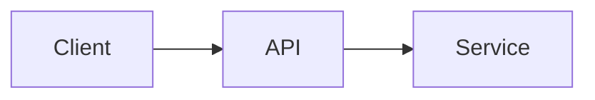
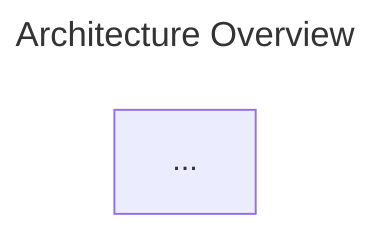

# Mermaid Diagram Export

Export Mermaid diagrams from documents to PNG images.

**CRITICAL RULE:** Always render diagrams immediately after creating or editing Mermaid code. Never commit a document with unrendered Mermaid diagrams.

---

## Tool Location

Relative to this skill directory:
```
mermaid/
├── render-mermaid.js      # Single diagram renderer
└── process-document.js    # Full document processor
```

---

## Quick Start

After creating/editing a document with Mermaid blocks:

```bash
# From the skill directory
node mermaid/process-document.js path/to/document.md --verbose

# With options
node mermaid/process-document.js document.md --theme=dark --verbose
```

---

## Workflow

### 1. Create Document with Mermaid

```markdown
# My Document


```

### 2. Export to PNG

```bash
node mermaid/process-document.js document.md --verbose
```

### 3. Result

The tool will:
- Extract all ` ``mermaid` blocks
- Render each to PNG in `diagrams/{document-name}/`
- Replace blocks with image + collapsible source

**Before:**
```markdown
` ``mermaid
flowchart LR
    A --> B
` ``
```

**After:**
```markdown


<details>
<summary>Mermaid Source</summary>

` ``mermaid
flowchart LR
    A --> B
` ``

</details>
```

---

## Single Diagram Rendering

```bash
# From .mmd file
node mermaid/render-mermaid.js diagram.mmd output.svg

# From stdin
echo "flowchart TD; A-->B" | node mermaid/render-mermaid.js --stdin output.svg

# With theme
node mermaid/render-mermaid.js diagram.mmd output.svg --theme=dark
```

---

## Options

- `--theme=<theme>` - Mermaid theme: `default`, `forest`, `dark`, `neutral`
- `--verbose` - Show detailed progress
- `--dry-run` - Preview without making changes

---

## Supported Document Types

| Extension | Image Syntax |
|-----------|--------------|
| `.md`, `.markdown` | `` with `<details>` |
| `.html`, `.htm` | `` tag with `<details>` |
| `.mdx` | JSX `` with comment |
| `.rst` | `.. image::` directive |
| `.adoc` | `image::` macro |

---

## Diagram Naming

Diagrams are named based on:
1. **Title** in diagram config (if present)
2. **First node name** in the diagram
3. **Fallback**: `diagram-1`, `diagram-2`, etc.

To control naming:

→ Generates `architecture-overview.png`

---

## Editing Rendered Diagrams

To edit a previously rendered diagram:
1. Expand the `<details>` block
2. Edit the mermaid code inside
3. Re-run: `node mermaid/process-document.js document.md`
4. Image file updates in place (document structure unchanged)

---

## Troubleshooting

### "Could not find Chrome"
Install dependencies: `cd mermaid && npm install`

### Diagram doesn't render
- Check syntax at https://mermaid.live
- Verify mermaid code is valid

### PNG too large/small
The tool auto-sizes based on content. Adjust viewport with CSS if needed.

---

## Complete Examples

```bash
# Process markdown file
node mermaid/process-document.js ./docs/README.md --verbose

# Dark theme
node mermaid/process-document.js ./docs/arch.md --theme=dark

# Dry run
node mermaid/process-document.js ./docs/README.md --dry-run

# Single diagram
node mermaid/render-mermaid.js ./flow.mmd ./output/flow.svg --theme=forest
```
