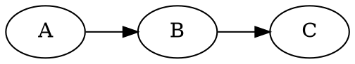
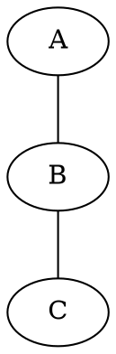
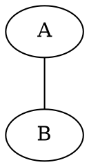

# DOT/Graphviz Diagram Export

Export DOT/Graphviz diagrams from documents to SVG images.

---

## Tool Location

Relative to this skill directory:
```
dot/
├── render-dot.js         # Single diagram renderer
└── process-document.js   # Full document processor
```

---

## Quick Start

After creating/editing a document with DOT blocks:

```bash
# From the skill directory
node dot/process-document.js path/to/document.md --verbose

# With specific layout engine
node dot/process-document.js document.md --layout=neato --verbose
```

---

## Workflow

### 1. Create Document with DOT

```markdown
# My Document


```

### 2. Export to SVG

```bash
node dot/process-document.js document.md --verbose
```

### 3. Result

The tool will:
- Extract all DOT code blocks (` ``dot`, ` ``graphviz`, ` ``gv`)
- Render each to SVG in `diagrams/{document-name}/`
- Replace blocks with image + commented source

**Before:**
```markdown
` ``dot
digraph { A -> B }
` ``
```

**After:**
```markdown


<!--
Original DOT diagram:
` ``dot
digraph { A -> B }
` ``
-->
```

---

## Layout Engines

Choose the appropriate engine for your graph:

| Engine | Best For | Description |
|--------|----------|-------------|
| `dot` | Hierarchical | Directed graphs, flowcharts (default) |
| `neato` | Undirected | Spring model for undirected graphs |
| `fdp` | Large graphs | Force-directed placement |
| `circo` | Circular | Circular layouts |
| `twopi` | Radial | Radial layouts with center node |
| `osage` | Clusters | Clustered layouts |
| `patchwork` | Treemaps | Rectangular tree maps |

---

## Specifying Layout

Three ways to specify layout engine:

**1. Command-line flag (global override):**
```bash
node dot/process-document.js doc.md --layout=neato
```

**2. Code fence (per-diagram):**
````markdown

````

**3. DOT comment:**


---

## Single Diagram Rendering

```bash
# From .dot file
node dot/render-dot.js diagram.dot output.svg

# With specific layout
node dot/render-dot.js diagram.dot output.svg --layout=circo

# From stdin
echo "digraph { A -> B }" | node dot/render-dot.js --stdin output.svg
```

---

## Options

- `--layout=<engine>` - Layout engine: `dot`, `neato`, `circo`, `fdp`, `twopi`, `osage`, `patchwork`
- `--verbose` - Show detailed progress
- `--dry-run` - Preview without making changes

---

## Supported Code Fence Types

- ` ``dot` - Standard DOT notation
- ` ``graphviz` - Alias for DOT
- ` ``gv` - Alias for DOT
- ` ``dot:neato` - With layout hint

---

## Diagram Naming

Diagrams are named based on:
1. **Graph name**: `digraph MyGraph { ... }` → `mygraph.svg`
2. **Label attribute**: `label="Network Topology"` → `network-topology.svg`
3. **Fallback**: `diagram-1.svg`, `diagram-2.svg`, etc.

---

## SVG Features

Generated SVGs are:
- **Responsive** - Width 100%, height auto
- **Sized properly** - viewBox set automatically
- **Max-width constrained** - Won't exceed natural size

---

## Complete Examples

```bash
# Process markdown with DOT diagrams
node dot/process-document.js ./docs/architecture.md --verbose

# Force neato layout for all diagrams
node dot/process-document.js ./docs/network.md --layout=neato

# Dry run to preview
node dot/process-document.js ./docs/README.md --dry-run

# Render single diagram
node dot/render-dot.js ./graph.dot ./output/graph.svg --layout=fdp
```

---

## Troubleshooting

### "Graphviz not found"
Install dependencies: `cd dot && npm install`

### Layout looks wrong
Try different engines:
- Hierarchical → `dot`
- Undirected → `neato`
- Large graphs → `fdp`
- Circular → `circo`

### SVG too large/small
The tool auto-sizes based on content. Use CSS to constrain if needed.
