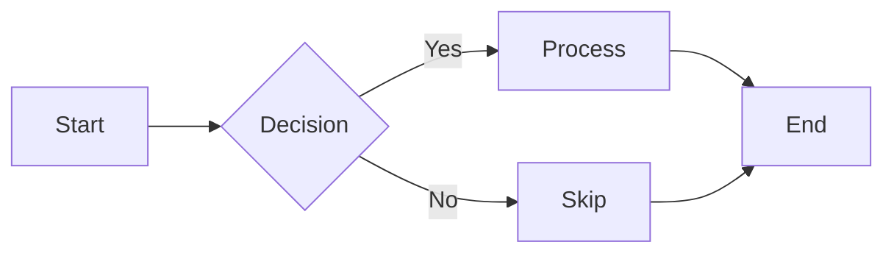
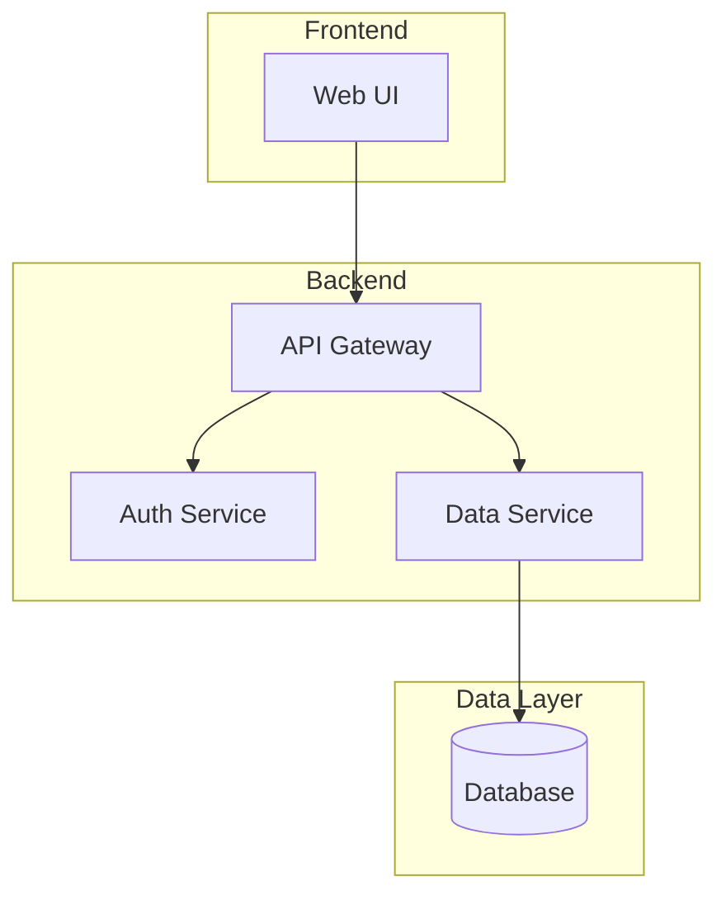

# Diagramming Skill

Professional diagram generation using Mermaid and DOT/Graphviz with semantic coloring, accessibility compliance, and secure rendering tools.

## Installation

### Via Marketplace (Recommended)

```bash
# Add the marketplace
/plugin marketplace add brunoamancio/agent-marketplace

# Install the diagramming skill
/plugin install diagramming@agent-marketplace
```

### Manual Installation

```bash
# Copy skill to Claude Code skills directory
cp -r skills/diagramming ~/.claude/skills/

# Install dependencies for rendering tools
cd ~/.claude/skills/diagramming/mermaid && npm install
cd ~/.claude/skills/diagramming/dot && npm install
```

## What's Included

### Comprehensive Diagram Support

- **Flowcharts** - Process flows, decision trees, algorithms
- **Sequence Diagrams** - API interactions, service communication
- **Class Diagrams** - OOP design, code architecture
- **State Diagrams** - State machines, workflow lifecycles
- **ER Diagrams** - Database schemas, data models
- **Gantt Charts** - Project timelines, schedules
- **Architecture Diagrams** - System design, cloud infrastructure, deployment
- **DOT/Graphviz** - Network graphs, semantic webs, ontologies
- **And more** - Pie charts, mindmaps, journey maps, timelines, C4, sankey

### Secure Rendering Tools

All tools have been security-hardened with fixes for:
- ✅ Command injection vulnerabilities
- ✅ Path traversal attacks
- ✅ Resource exhaustion (DoS)
- ✅ CDN supply chain risks

See [SECURITY.md](../../SECURITY.md) for details.

### Export Capabilities

- **Mermaid → PNG** - Render Mermaid diagrams to PNG images
- **DOT → SVG** - Render Graphviz diagrams to SVG images
- **Document processing** - Process entire documents with multiple diagrams
- **Re-rendering** - Update diagrams in-place when source changes

## Quick Start

### Create a Diagram

Just describe what you want to Claude:

```
"Create a flowchart showing the user login process"
"Draw a sequence diagram for the checkout API flow"
"Generate an architecture diagram for a microservices system"
```

Claude will automatically invoke the diagramming skill and create the appropriate diagram type.

### Export Diagrams to Images

After creating diagrams in your document:

```bash
# Export Mermaid diagrams to PNG
node ~/.claude/skills/diagramming/mermaid/process-document.js README.md --verbose

# Export DOT diagrams to SVG
node ~/.claude/skills/diagramming/dot/process-document.js README.md --verbose
```

See [20-MERMAID-EXPORT.md](20-MERMAID-EXPORT.md) and [21-DOT-EXPORT.md](21-DOT-EXPORT.md) for complete export workflows.

## Directory Structure

```
diagramming/
├── SKILL.md                          # Main skill entry point
├── README.md                         # This file
│
├── Diagram Type Guides
├── 02-FLOWCHART-GUIDE.md            # Process flows, decision trees
├── 03-SEQUENCE-DIAGRAM-GUIDE.md     # API interactions, service calls
├── 04-CLASS-DIAGRAM-GUIDE.md        # OOP design, code structure
├── 05-STATE-DIAGRAM-GUIDE.md        # State machines, workflows
├── 06-ER-DIAGRAM-GUIDE.md           # Database schemas
├── 07-GANTT-GUIDE.md                # Project timelines
├── 08-OTHER-DIAGRAMS-GUIDE.md       # Pie, mindmap, journey, timeline, etc.
│
├── Styling & Configuration
├── 09-STYLING-GUIDE.md              # Cagle color palette, themes, styling
├── 16-CONFIGURATION-REFERENCE.md    # ELK layout, all config options
│
├── Architecture & Patterns
├── 10-USE-CASE-SCENARIOS.md         # Diagram type selection guide
├── 12-SOLUTION-ARCHITECTURE-GUIDE.md # System architecture patterns
├── 13-DATA-FLOW-PATTERNS-GUIDE.md   # Data flows, async, events
├── 14-DEPLOYMENT-ARCHITECTURE-GUIDE.md # Cloud, K8s, CI/CD
├── 15-TECHNICAL-DESIGN-PATTERNS-GUIDE.md # Design patterns, DDD
│
├── Specialized Diagrams
├── 17-LINKED-DATA-GUIDE.md          # RDF, ontologies, SHACL, SPARQL
├── 18-PROPERTY-GRAPH-GUIDE.md       # Neo4j, Cypher, graph databases
├── 19-DOT-GRAPHVIZ-GUIDE.md         # DOT/Graphviz for network graphs
│
├── Export Tools
├── 20-MERMAID-EXPORT.md             # Mermaid rendering workflow
├── 21-DOT-EXPORT.md                 # DOT rendering workflow
│
└── Rendering Tools (self-contained)
    ├── mermaid/                      # Mermaid renderer
    │   ├── render-mermaid.js        # Single diagram → SVG/PNG
    │   ├── process-document.js      # Process full documents
    │   ├── svg-to-png.js           # SVG → PNG conversion
    │   ├── md-to-pdf.js            # Markdown → PDF
    │   └── package.json
    ├── dot/                          # DOT/Graphviz renderer
    │   ├── render-dot.js           # Single diagram → SVG
    │   ├── process-document.js     # Process full documents
    │   └── package.json
    ├── lib/                          # Shared security utilities
    │   ├── security.js             # Path validation, sanitization
    │   └── puppeteer-helper.js     # Secure browser launch
    └── markdown-export/              # Markdown tools
        └── convert.js
```

## Key Features

### The Cagle Color System

Based on Kurt Cagle's semantic visualization approach:

| Type | Fill | Stroke | Use Case |
|------|------|--------|----------|
| Infrastructure | `#E3F2FD` | `#1565C0` | Cloud, platforms, networks |
| Service | `#E8F5E9` | `#2E7D32` | APIs, microservices |
| Data | `#FFF8E1` | `#F57F17` | Databases, storage |
| User/Actor | `#F3E5F5` | `#7B1FA2` | People, roles |
| Process | `#E1F5FE` | `#0277BD` | Workflows, actions |
| Security | `#E0F2F1` | `#00695C` | Auth, encryption |

All colors are WCAG AA compliant for accessibility.

### ELK Layout for Complex Diagrams

For diagrams with >10 nodes or dense connections:

```yaml
---
config:
  layout: elk
  elk:
    mergeEdges: false
    nodePlacementStrategy: BRANDES_KOEPF
---
```

### Accessibility First

- `accTitle` and `accDescr` for screen readers
- WCAG AA contrast ratios
- Semantic color meanings
- Alternative text for all diagrams

## Quick Reference

### When to Use Each Diagram Type

| Need to Show | Use This | Guide |
|--------------|----------|-------|
| Process/decision flow | Flowchart | [02](02-FLOWCHART-GUIDE.md) |
| API interactions | Sequence Diagram | [03](03-SEQUENCE-DIAGRAM-GUIDE.md) |
| Database schema | ER Diagram | [06](06-ER-DIAGRAM-GUIDE.md) |
| OOP design | Class Diagram | [04](04-CLASS-DIAGRAM-GUIDE.md) |
| Workflow states | State Diagram | [05](05-STATE-DIAGRAM-GUIDE.md) |
| Project schedule | Gantt Chart | [07](07-GANTT-GUIDE.md) |
| System architecture | Flowchart + ELK | [12](12-SOLUTION-ARCHITECTURE-GUIDE.md) |
| Cloud infrastructure | Flowchart | [14](14-DEPLOYMENT-ARCHITECTURE-GUIDE.md) |
| Data flows | Sequence | [13](13-DATA-FLOW-PATTERNS-GUIDE.md) |
| Knowledge graphs | Flowchart LR + ELK | [17](17-LINKED-DATA-GUIDE.md) |
| Pure networks | DOT/Graphviz | [19](19-DOT-GRAPHVIZ-GUIDE.md) |

See [10-USE-CASE-SCENARIOS.md](10-USE-CASE-SCENARIOS.md) for comprehensive scenario mapping.

## Resources

### Kurt Cagle's Work

This skill is inspired by Kurt Cagle's approach to data visualization:

- [The Ontologist (Substack)](https://ontologist.substack.com/)
- [RDF, Graphs and Mermaid Diagrams](https://www.linkedin.com/pulse/rdf-graphs-mermaid-diagrams-kurt-cagle-jqrac)
- [Ask Any (Technical) Mermaid](https://kurtcagle.wpcomstaging.com/2023/01/06/ask-any-technical-mermaid/)

### Official Documentation

- [Mermaid Documentation](https://mermaid.js.org/)
- [Mermaid Live Editor](https://mermaid.live/)
- [Graphviz Documentation](https://graphviz.org/documentation/)

## Examples

### Flowchart


### Architecture Diagram


## Security

All rendering tools have been security-hardened with comprehensive fixes:

| Issue | Severity | Status |
|-------|----------|--------|
| Command injection in md-to-pdf.js | 🔴 CRITICAL | ✅ Fixed |
| Path traversal in all renderers | 🟡 HIGH | ✅ Fixed |
| Resource exhaustion (Puppeteer) | 🟡 MEDIUM | ✅ Fixed |
| CDN dependency (Mermaid) | 🟢 LOW | ✅ Fixed |

**npm audit results:** 0 vulnerabilities across all tools.

See [../../SECURITY.md](../../SECURITY.md) for detailed documentation on:

- Security improvements and fixes
- Vulnerability testing procedures
- Dependency audit results

## License

Follows the same license as the original claude-config repository (MIT).

---

*"Mermaid is quietly entering into tool chains in the data architecture and semantic stacks."*
— Kurt Cagle
