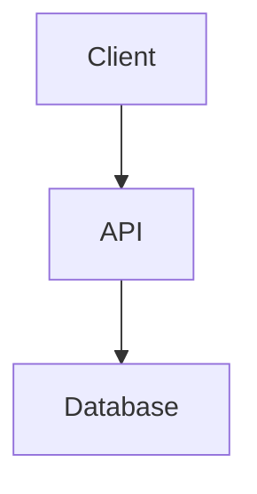
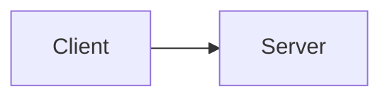

# Markdown Editor Skill

Professional markdown editing with automatic diagram-to-image conversion for maximum compatibility.

## Features

- **Diagram Image Generation**: Convert Mermaid and Graphviz diagrams to PNG images
- **Formatting Enforcement**: Automatic blank line rules for professional markdown
- **ASCII Art Replacement**: Promotes accessible diagrams over ASCII art
- **Hybrid Approach**: Support both live rendering and static images

## Installation

### Via Marketplace (Recommended)

```bash
# Add the marketplace
/plugin marketplace add brunoamancio/agent-marketplace

# Install the markdown-editor skill
/plugin install markdown-editor@agent-marketplace
```

### Manual Installation

```bash
# Copy skill to Claude Code skills directory
cp -r skills/markdown-editor ~/.claude/skills/
```

**Note:** This skill depends on the `diagramming` skill's rendering tools for image generation.

## What This Skill Does

### 1. Diagram Image Generation

When you need images in markdown files, this skill generates PNG images from diagrams:

**Workflow:**
1. Create diagram (Mermaid or Graphviz)
2. Render directly to PNG (both Mermaid and Graphviz)
3. Insert PNG reference in markdown
4. Clean up temporary files

**Example:**

```bash
# Generate a flowchart image (Mermaid renders directly to PNG)
echo "flowchart LR
    A[Start] --> B[Process] --> C[End]" > temp.mmd

node ~/.claude/skills/diagramming/mermaid/render-mermaid.js temp.mmd ./images/flowchart.png
rm temp.mmd
```

Then in markdown:
```markdown

```

### 2. When to Use Images vs Live Diagrams

**Use PNG images when:**
- Maximum compatibility is required
- Exporting to PDF, Word, or presentations
- Platform doesn't support Mermaid rendering
- Diagrams are complex and may have rendering issues

**Use Mermaid code blocks when:**
- Platform renders Mermaid natively (GitHub, GitLab)
- Diagrams need frequent editing
- Keeping diagrams as editable source code

**Use SVG images when:**
- User explicitly requests SVG format
- Vector graphics needed for scaling/zooming
- File size optimization (SVG often smaller than PNG)
- Working on platforms with excellent SVG support

**Hybrid approach (recommended):**
Include both the PNG and the source in a collapsible section:

````markdown


<details>
<summary>Diagram source</summary>


</details>
````

### 3. Markdown Formatting Rules

The skill enforces professional markdown formatting:

| Element | Before | After |
|---------|--------|-------|
| Heading | Blank line | Blank line |
| Code block | Blank line | Blank line |
| List (first item) | Blank line | - |
| List (last item) | - | Blank line |
| Table | Blank line | Blank line |

**Common fixes:**
- Adds blank lines before/after headings
- Adds blank lines before/after code blocks
- Removes blank lines between list items
- Ensures proper spacing around tables and blockquotes

### 4. ASCII Art Replacement

The skill automatically identifies and replaces ASCII art with proper diagrams:

**Before:**
```
+--------+      +--------+
| Client | ---> | Server |
+--------+      +--------+
```

**After:**


## Quick Reference

### Generating Mermaid Images

```bash
# 1. Create diagram source
cat > diagram.mmd <<EOF
flowchart LR
    A[Start] --> B[End]
EOF

# 2. Render directly to PNG
node ~/.claude/skills/diagramming/mermaid/render-mermaid.js diagram.mmd ./images/diagram.png

# 3. Clean up
rm diagram.mmd
```

### Generating Graphviz Images

```bash
# 1. Create DOT source
cat > graph.dot <<EOF
digraph G {
    A -> B -> C;
}
EOF

# 2. Render directly to PNG
node ~/.claude/skills/diagramming/dot/render-dot.js graph.dot ./images/graph.png

# 3. Clean up
rm graph.dot
```

### Generating SVG Images (When Requested)

**Mermaid to SVG:**
```bash
# Render to SVG (default)
node ~/.claude/skills/diagramming/mermaid/render-mermaid.js diagram.mmd ./images/diagram.svg
```

**Graphviz to SVG:**
```bash
# Render to SVG (default)
node ~/.claude/skills/diagramming/dot/render-dot.js graph.dot ./images/graph.svg
```

**When to use:** User explicitly requests SVG, vector graphics needed, or file size optimization.

### Image Organization

Recommended directory structure:

```
project/
├── README.md
├── images/
│   ├── architecture.png
│   ├── flowchart.png
│   └── sequence.png
└── docs/
    ├── guide.md
    └── images/
        └── diagram.png
```

### Alt Text Best Practices

Always provide descriptive alt text for accessibility:

✅ **Good:**
```markdown

```

❌ **Bad:**
```markdown


```

## Dependencies

This skill requires the **diagramming** skill's rendering tools:

- `skills/diagramming/mermaid/render-mermaid.js` - Mermaid to SVG/PNG
- `skills/diagramming/dot/render-dot.js` - Graphviz to SVG/PNG
- `skills/svg-to-png/svg-to-png.js` - SVG to PNG conversion (if needed)

Install the diagramming skill first:

```bash
/plugin install diagramming@agent-marketplace
```

## Use Cases

### Documentation with Diagrams

Creating technical documentation that includes architecture diagrams, flowcharts, and sequence diagrams as PNG images for universal compatibility.

### Wiki Pages

Converting markdown files with diagrams to formats that work in wikis that don't support Mermaid rendering.

### Export-Ready Markdown

Preparing markdown files that will be converted to PDF, Word documents, or presentations where PNG images are required.

### Accessibility-First Content

Replacing ASCII art diagrams with proper accessible diagrams that include alt text and semantic meaning.

## Examples

### Example 1: Architecture Diagram

```markdown
## System Architecture


The system uses a three-tier architecture:
- Frontend: React web application
- Backend: Node.js API servers
- Data: PostgreSQL cluster
```

### Example 2: Process Flow

```markdown
## Deployment Process


Our deployment process includes:
1. Automated testing on every commit
2. Build and package in CI environment
3. Deploy to staging for validation
4. Production deployment with rollback capability
```

## Tips

1. **Name images descriptively**: Use `architecture.png` not `diagram1.png`
2. **Organize by topic**: Group related diagrams in subdirectories
3. **Version control**: Keep diagram source files (`.mmd`, `.dot`) in repo
4. **Maintain consistency**: Use same style/colors across diagrams
5. **Update together**: When changing diagram, regenerate PNG immediately

## Related Skills

- **diagramming**: For creating and styling Mermaid/Graphviz diagrams
- See [skills/diagramming/SKILL.md](../diagramming/SKILL.md) for diagram types and styling

## License

MIT - Same as the agent-marketplace repository.
