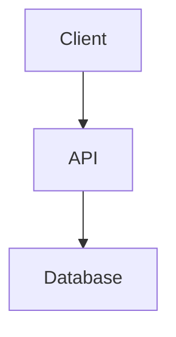

# Markdown Editor Skill

Enforce consistent markdown formatting and handle diagram image generation when editing `.md` files.

## Image Generation for Diagrams

When images are needed in markdown files, generate diagrams and convert them to PNG images:

### Workflow

1. **Create diagram** using Mermaid or Graphviz syntax
2. **Render directly to PNG** using the diagramming skill's tools (both Mermaid and Graphviz support PNG)
3. **Insert PNG reference** into the markdown file
4. **Clean up temporary files**

### When to Generate Images

Generate PNG images when:
- The markdown file will be viewed on platforms that don't render Mermaid natively (GitHub wikis, static sites, documentation portals)
- Images need to be included in exports (PDF, Word, presentations)
- Diagrams must persist even if the renderer changes
- Maximum compatibility is required

### How to Generate Images

**For Mermaid diagrams:**

```bash
# Step 1: Create a temporary .mmd file with diagram source
echo "flowchart LR
    A[Start] --> B[End]" > temp.mmd

# Step 2: Render directly to PNG
node ~/.claude/skills/diagramming/mermaid/render-mermaid.js temp.mmd diagram.png

# Step 3: Clean up
rm temp.mmd

# Step 4: Reference in markdown
# 
```

**For Graphviz/DOT diagrams:**

```bash
# Step 1: Create a temporary .dot file
echo "digraph G {
    A -> B -> C;
}" > temp.dot

# Step 2: Render directly to PNG
node ~/.claude/skills/diagramming/dot/render-dot.js temp.dot diagram.png

# Step 3: Clean up
rm temp.dot

# Step 4: Reference in markdown
# 
```

**Note:** Both Mermaid and Graphviz can now render directly to PNG!

### Generating SVG Images (When Explicitly Requested)

While PNG is recommended for maximum compatibility, SVG can be used when explicitly requested by the user:

**For Mermaid diagrams (SVG):**

```bash
# Render to SVG (default format)
node ~/.claude/skills/diagramming/mermaid/render-mermaid.js diagram.mmd diagram.svg

# Reference in markdown
# 
```

**For Graphviz/DOT diagrams (SVG):**

```bash
# Render to SVG (default format)
node ~/.claude/skills/diagramming/dot/render-dot.js graph.dot graph.svg

# Reference in markdown
# 
```

**When to use SVG:**
- User explicitly requests SVG format
- Working on platforms with excellent SVG support (modern browsers)
- Need vector graphics for scaling/zooming
- File size is a concern (SVG is often smaller than PNG)

**Note:** Always respect the user's explicit format request, even if PNG would be more compatible.

### Image Organization

Place generated images in a logical location:
- `./images/` - for images in root-level markdown files
- `./docs/images/` - for documentation images
- Same directory as the markdown file - for co-located resources

### Alt Text Requirements

ALWAYS provide descriptive alt text for accessibility:

```markdown

```

NOT:
```markdown

```

## When to Use Live Diagrams vs Images

### Use Mermaid code blocks (live rendering):
- On platforms that render Mermaid natively (GitHub README, GitLab, many static site generators)
- When diagrams need to be easily edited in the future
- For diagrams that may change frequently

### Use PNG images:
- Maximum compatibility across all renderers
- When including in exports (PDF, presentations)
- For complex diagrams that may have rendering issues
- When diagram source is maintained separately

### Hybrid Approach (Recommended):
Include BOTH the Mermaid source AND the PNG image:

````markdown
## Architecture


<details>
<summary>Diagram source (Mermaid)</summary>


</details>
````

This provides:
- ✅ Universal rendering (PNG)
- ✅ Easy editing (Mermaid source)
- ✅ Version control-friendly (text source)

## CRITICAL: Use Diagrams, Not ASCII Art

**NEVER use ASCII art for diagrams in markdown files.** When creating or editing `.md` files:

1. **Replace existing ASCII diagrams** with Mermaid/Graphviz equivalents
2. **Create new diagrams** using proper diagramming syntax, never ASCII
3. **Convert on sight** - if you see ASCII art representing a flow, architecture, sequence, or any visual concept, convert it

ASCII art is not accessible, not maintainable, and not professional. Use diagrams for:
- Flowcharts, process flows, decision trees
- Sequence diagrams, API interactions
- State machines, lifecycles
- Architecture diagrams
- Network topologies
- Any visual representation

Invoke the `diagramming` skill for detailed Mermaid/Graphviz syntax and styling guidance.

---

## Blank Line Rules

| Context | Before | After |
|---------|--------|-------|
| Heading (`#`, `##`, etc.) | YES | YES |
| Code block (```) | YES | YES |
| List (first item) | YES | - |
| List (last item) | - | YES |
| Table | YES | YES |
| Blockquote (`>`) | YES | YES |
| Horizontal rule (`---`) | YES | YES |

**Between list items**: NO blank lines (creates separate lists)

## Quick Reference

```markdown
# Correct

Text paragraph here.

## Heading

Intro text.

- item 1
- item 2
- item 3

More text.

```code
example
```

Final text.
```

```markdown
# WRONG - Missing blank lines

Text paragraph here.
## Heading
Intro text.
- item 1

- item 2
More text.
```code
example
```
Final text.
```

## Validation Pattern

To find violations (code blocks without preceding blank line):

```bash
grep -Pzo '\S\n```[a-z]' **/*.md
```

Or use the multiline grep pattern: `\S\n` ` ``` `

## Auto-Fix Checklist

When editing markdown:

1. **Before code blocks**: Ensure blank line after any non-blank line
2. **After code blocks**: Ensure blank line before next content
3. **Before lists**: Ensure blank line after preceding paragraph
4. **Between list items**: Remove any blank lines
5. **After headings**: Ensure blank line before content

## Common Violations

| Pattern | Problem | Fix |
|---------|---------|-----|
| `text\n```lang` | No blank before code | Add blank line |
| `text:\n```lang` | No blank after colon | Add blank line |
| `**Bold:**\n```lang` | No blank after bold label | Add blank line |
| `- item\n\n- item` | Blank between list items | Remove blank line |
| `## Heading\nText` | No blank after heading | Add blank line |
| `text\n## Heading` | No blank before heading | Add blank line |

## Batch Fixing

When fixing multiple files:

1. Use Grep to find all violations: `\S\n```[a-z]`
2. Read each file with violations
3. Apply Edit tool to add missing blank lines
4. Pattern: change `text\n```lang` to `text\n\n```lang`
